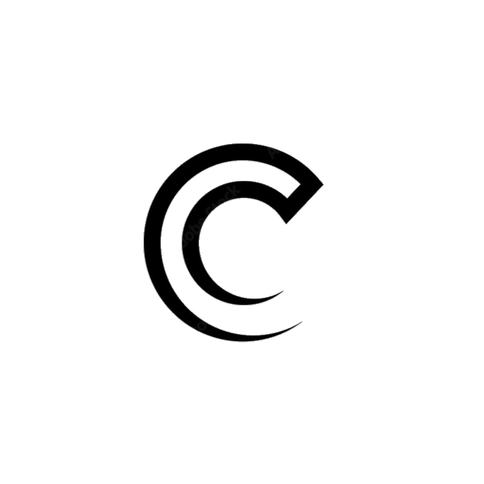

# Control Com by Robert Tezock

Welcome to ControlCom!

ControlCom is a .NET based app designed for vocally controlled use of desktops and laptops.

## Home View
  

## Commands View
  

## Usage of ControlCom  

[Using ControlCom](https://user-images.githubusercontent.com/105029396/224746000-fab0e16c-20c2-418e-92ea-d21fb6544729.mp4)  
  
  
  
  
Design Inspiration from [Payload](https://www.youtube.com/@_buffer)

